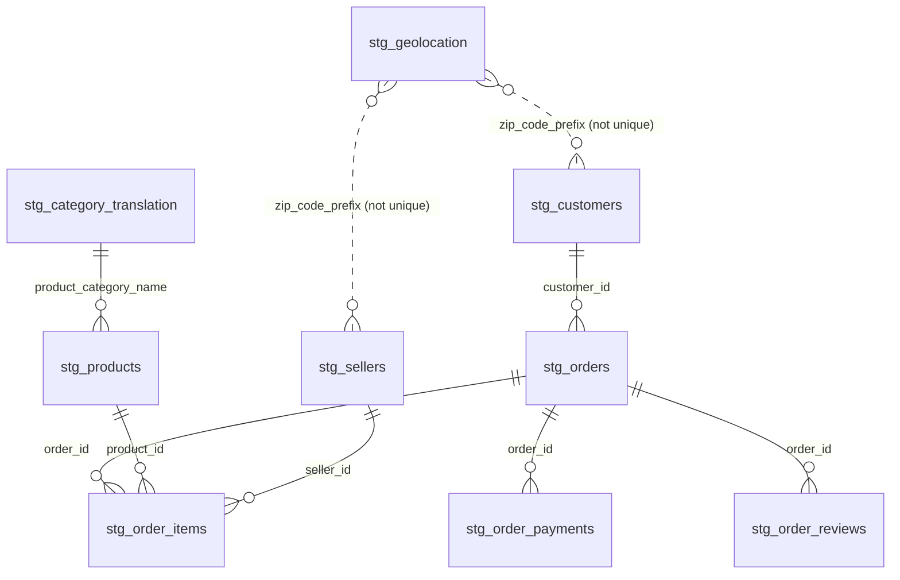

# Table relationships

Notes:
- `customer_id` is per order; use `customer_unique_id` to identify a real customer.
- `stg_geolocation` has many rows per zip prefix, so joining on it multiplies rows. Deduplicate it before joining.
