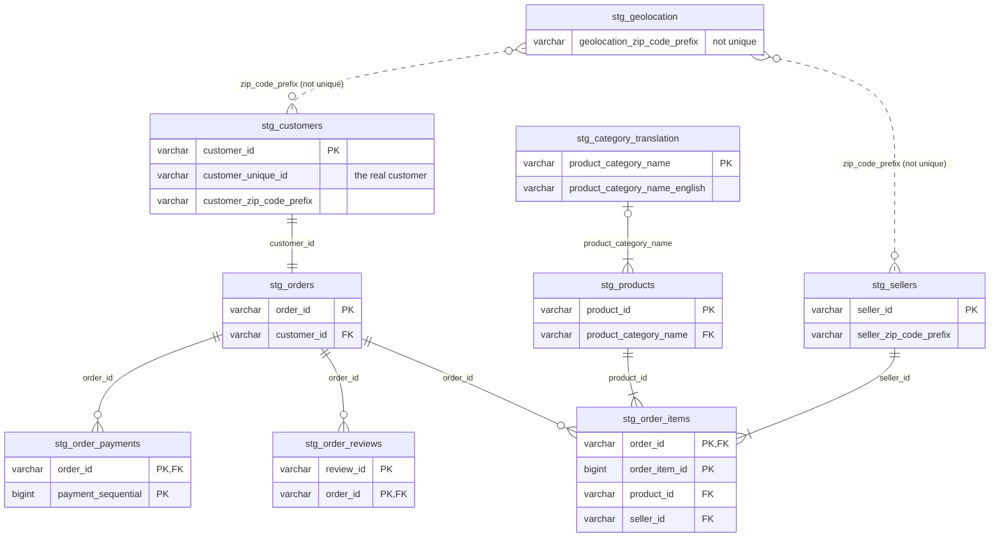

# Table relationships

Cardinalities are taken from the loaded data (see [profiling.md](profiling.md)).

Notes:
- `customer_id` is per order, so customers to orders is 1:1; use `customer_unique_id` to identify a real customer.
- 775 orders have no items, 1 order has no payment, and 768 orders have no review.
- `review_id` alone is not unique (789 duplicates) because one review can cover several orders; `(review_id, order_id)` is unique, and 547 orders have more than one review.
- A product has zero or one English category: 610 products have no category and 13 have a category missing from the translation table (`pc_gamer`, `portateis_cozinha_e_preparadores_de_alimentos`).
- `stg_geolocation` has many rows per zip prefix, so joining on it multiplies rows.
  Deduplicate it before joining.
  157 customer zip prefixes and 7 seller zip prefixes have no geolocation row.
